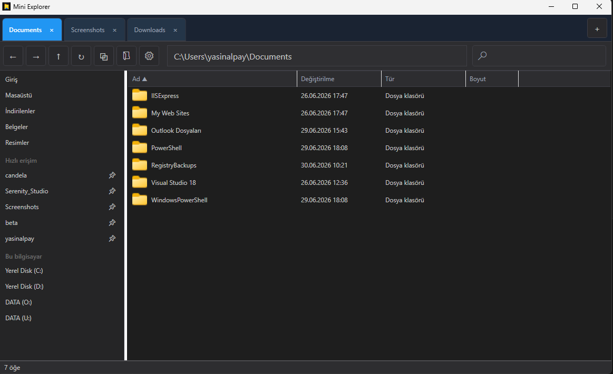
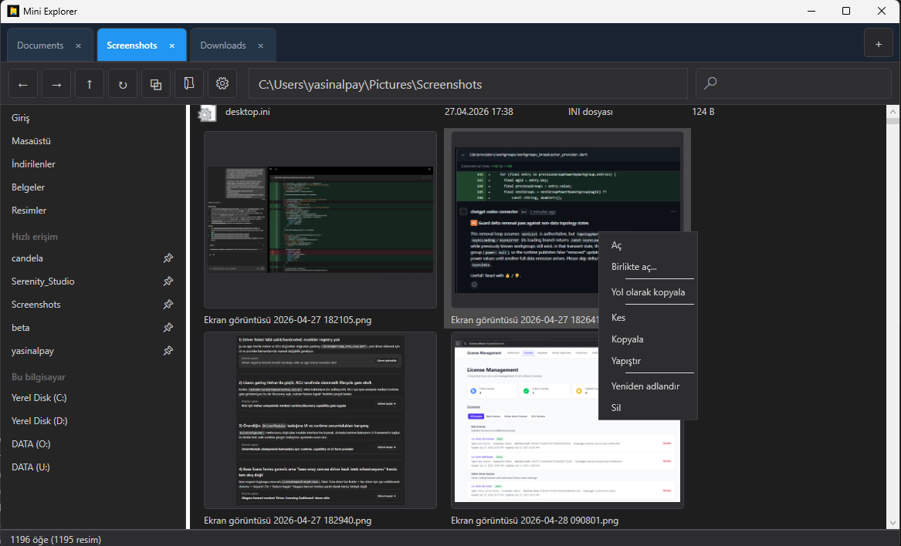
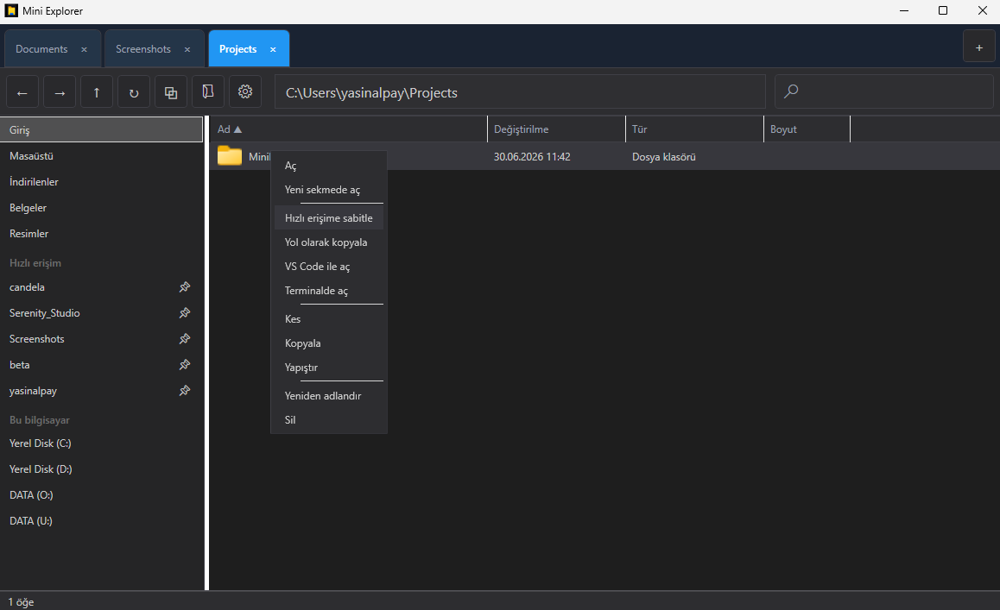
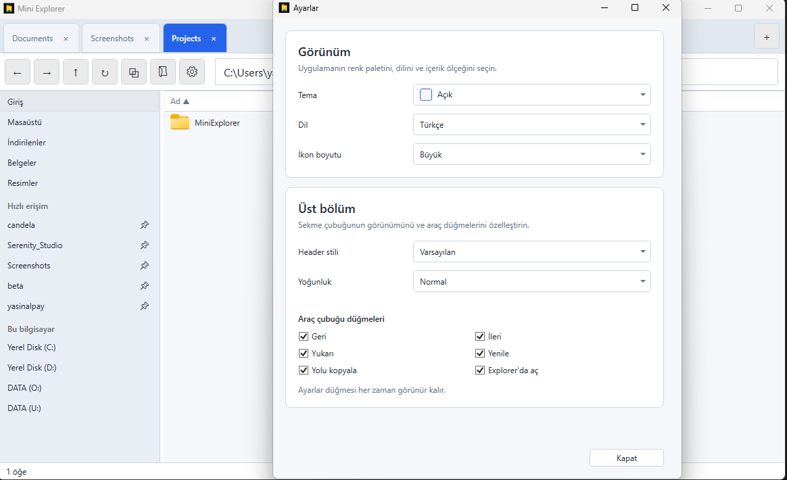

# MiniExplorer

MiniExplorer is a lightweight, tabbed file explorer for Windows built with WPF
and .NET 10.

## Download

[**Download MiniExplorer.exe**](https://github.com/yalpayelekon/MiniExplorer/releases/latest/download/MiniExplorer.exe)

The ready-to-run release supports 64-bit Windows 10 or later and does not
require a separate .NET installation. Because the executable is not currently
code-signed, Windows SmartScreen may display a warning when it is first run.

[View all releases](https://github.com/yalpayelekon/MiniExplorer/releases)

## Screenshots

### File browsing



### Picture gallery



### Context menu



### Settings



## Features

- Browse folders in multiple tabs with back, forward, up, and refresh navigation
- Restore open tabs between sessions
- Pin folders to Quick Access
- Filter the contents of the current folder
- Preview pictures in a thumbnail layout
- Copy, cut, paste, rename, and move items to the Recycle Bin
- Drag files and folders to Explorer, the desktop, and other Windows apps (multi-selection supported)
- Open files with their associated applications
- Open folders in Windows Explorer or Visual Studio Code
- Open supported files in Notepad++
- Customize the interface in Settings: theme, header style, density, icon size, and toolbar buttons
- Switch between Turkish and English

## Requirements

- Windows 10 or later (64-bit)
- [.NET 10 SDK](https://dotnet.microsoft.com/download/dotnet/10.0) when building
  from source

## Getting started

Clone the repository and run the application:

```powershell
git clone https://github.com/yalpayelekon/MiniExplorer.git
cd MiniExplorer
dotnet run --project .\MiniExplorer\MiniExplorer.csproj
```

To build it without running:

```powershell
dotnet build .\MiniExplorer.slnx
```

## Project structure

MiniExplorer follows an MVVM-oriented structure:

- `Models` contains file-system and session data types.
- `ViewModels` contains navigation and UI state.
- `Views` contains application dialogs.
- `Services` handles file-system, shell, clipboard, session, and thumbnail work.
- `Helpers` and `Converters` contain Windows integration and WPF utilities.

## Contributing

Bug reports and pull requests are welcome. See
[CONTRIBUTING.md](CONTRIBUTING.md) for the development workflow.

## License

MiniExplorer is available under the [MIT License](LICENSE).
